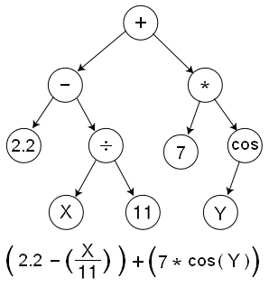
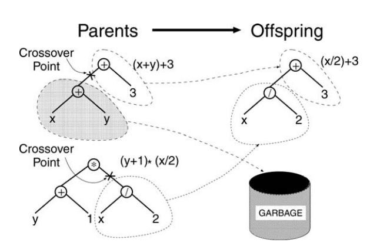
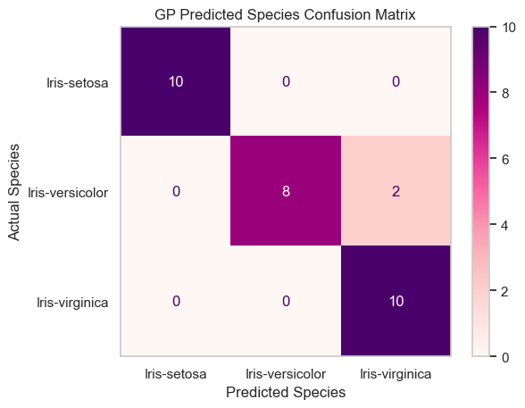
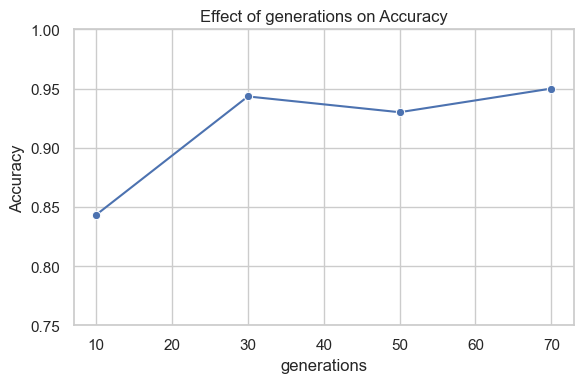
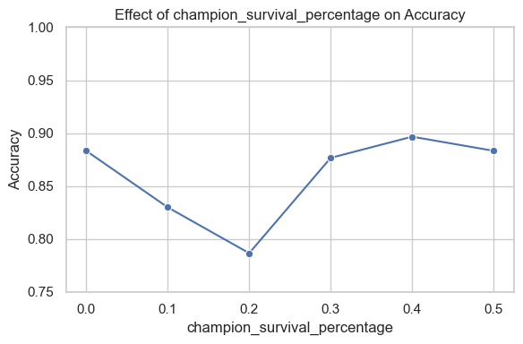
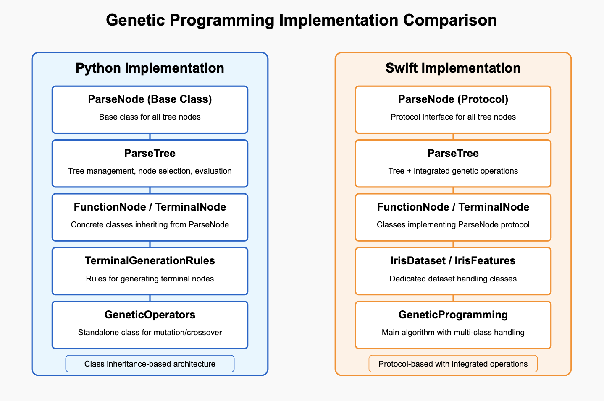
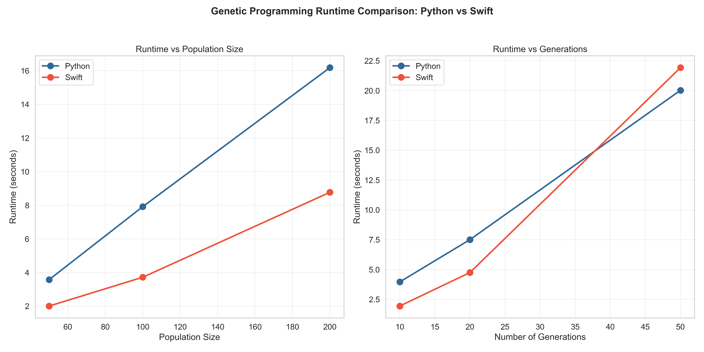

# Genetic Programming

Enricco Gemha, Ian Lum, Sally Lee

Final project for Advanced Algorithms, exploring genetic programming

## Repo Overview

```
genetic-programming/
├── data/
│   ├── benchmarking/
│   ├── param_sweep/
│   ├── Iris.csv
├── img/
├── Python/
│   ├── benchmarking/
│   │   ├── compare_benchmarks.py
│   │   ├── python_benchmarks.py
│   │   ├── swift_benchmarks.py
│   ├── data_visualizations.ipynb
│   ├── genetic_programming.py
│   ├── main.ipynb
│   ├── parameter_sweep.py
│   ├── parse_tree.py
│   ├── visualizations.py
├── Swift/
│   ├── main.swift
│   ├── swift.md
```

- `data/`: Contains the iris dataset, as well as the results of the parameter
  sweep and benchmarking runs.
- `img/`: Contains images used in the report, including results of benchmarking
  parameter sweep
- `Python/`
  - `main.ipynb`: Main file to run the genetic programming algorithm, as well as
    generate visualizations of the results.
  - `data_visualizations.ipynb`: Visualizations of the iris dataset, to gain a
    better understanding of the data.
  - `genetic_programming.py`, `parse_tree.py`: Implementation of the genetic
    programming algorithm and parse tree data structure.
  - `parameter_sweep.py`, `visualizations.py`: Code for visualization and
    analysis of results.
  - `benchmarking/`: Code to run the benchmarking experiments.
- `Swift/`: Contains the Swift implementation of the genetic programming and
  documentation.

## Background of Algorithm

Genetic programming (GP) applies the principles of biological evolution to
generate computer programs [1]. GP follows the Darwinian survival of the
fittest, as well as utilizing genetic operations like random mutation and
crossover as it evolves over multiple generations.

There are a few variants of genetic programming, each representing the evolved
program in different ways. These include tree-based GP, stack-based GP, and
Linear GP [2]. We implemented tree-based GP, the most common variant, to solve
our problem. In tree-based GP, programs are represented as parse trees which are
evaluated recursively to produce multivariate expressions. The terminal nodes
(or leaf nodes) in a parse tree are variables or constants and the internal
nodes are operators such as addition, multiplication, trigonometry function, and
more.



Genetic programming is classically implemented in Lisp due to its prefix
notation cleanly being able to represent parse trees [3]. However, for our
implementation, we used Python, and Swift.

GP is commonly used to solve automatic programming and machine learning problems
[1]. In this project, we use GP to classify species of iris flowers from the
classic [UCI iris dataset](https://www.kaggle.com/datasets/uciml/iris). The
dataset contains the length and width of the sepal and petal for 150 irises,
along with each flower’s species—either setosa, versicolor, or virginica.

Our goal is to evolve mathematical expressions that take the sepal and petal
dimensions as inputs, then output a number that maps to one of three species of
iris. From there, we will perform a parameter sweep on the various parameters of
GP (mutation rate, crossover rate, etc.) to see how each affects the accuracy of
the evolved expression.

## How It Works

### Parse Tree Implementation

This section discusses the implementation in
[`python/parse_tree.py`](python/parse_tree.py).

#### Node Structure

We wrote our own implementation of parse trees that were able to be randomly
generated from a function set and terminal (leaf node) generation rules.

The internal (non-leaf) nodes randomly select a function from addition,
subtraction, multiplication, division, sine, cosine, and natural logarithm. The
exponential function was also implemented but can easily cause integer overflow
errors, and thus was not used.

The terminal or leaf nodes are randomized given a set of rules, these being:

- `literals`: A set of literals, either variables like X or Y, or specific
  numbers
- `constants_range`: A tuple range from which numbers can be randomly selected
  from
- `ints_only`: A boolean controlling whether randomly generated constants can
  have fractional values
- `no_random_constants`: A boolean controlling whether randomly generated
  constants are included at all.
- `decimal_places`: The number of decimal places for randomly generated
  constants, defaults to 4.

For each terminal node, it has an equal chance of choosing from any of the
literals and randomly generating a constant. For example, if the literals are
["X", "Y"], there is a 1/3 chance of choosing "X", 1/3 chance of choosing "Y",
and 1/3 chance of generating a random constant.

#### Tree generation

Parse trees can either be generated with the “full” or “grow” method. With the
“full” method, the resulting parse tree is guaranteed to be a full tree at a
given depth. With the “grow” method, branches have a chance to terminate early,
before the max depth. This chance is given by the terminal_prob argument.

Note: The root node is defined to be at depth 0, with the children of the root
note being depth 1. Thus, the trees in the diagrams above are depth 2 trees.

Full tree generation:


Grow tree generation:


Diagrams from Langdon et al. [3]

#### Tree evaluation

To evaluate a parse tree, a dictionary mapping variables to numeric values is
taken as input. Nodes evaluate their values recursively, with the base case
being terminal nodes that simply return their numeric value.


An example parse tree evaluation. (1) variables are mapped to their numeric
values. (2) the subtraction node is evaluated as 2-3. (3) the addition node is
evaluated as 4 + (-1). (4) an output value of 3 is calculated.

### GP Algorithm

This section discusses the implementation in
[`python/genetic_programming.py`](python/genetic_programming.py).

The genetic programming algorithm performs the following steps:

1. Randomize initial population of parse trees
2. Survive a number of the best performing individuals (champions) to the next
   generation
3. For the rest of the population, select parents and perform crossover to spawn
   offspring
4. The new population of champions and offspring all have a chance to mutate
5. Repeat from #2 for a number of generations

#### Classification

Parse trees classified the three irises by taking sepal length, sepal width,
petal length, petal width and outputting a single number, $`A`$. The value of
$`A`$ is converted to a species via the following inequalities:

$$
\begin{cases}
A < 0.33 & \rightarrow \text{Setosa} \\
0.33 \leq A < 0.66 & \rightarrow \text{Versicolor} \\
0.66 \leq A & \rightarrow \text{Virginica} \\
\end{cases}
$$

The thresholds of 0.33 and 0.66 were arbitrarily defined and other thresholds
would work similarly well. While these thresholds in a sense expect $`A`$ values
from 0-1, there is no constraint limiting output to that range, though programs
that produce outputs around that range will naturally perform better and thus
persist in the survival of the fittest. If thresholds of 50 and 100 were
selected, then the best performing parse trees would be those that produce
output on that magnitude.

#### Fitness function

The fitness of each parse tree was evaluated by having the given tree attempt to
classify all irises in the training portion of the dataset (a random 80% of the
original dataset). Each iris that would add 1 to an individual’s fitness.

#### Initial Population Generation

The following parameters were used for the generation of our initial population:

- Population size: 50
- Function set: addition, subtraction, multiplication, division
- Terminal rules:
  - Literals: sepal length, sepal width, petal length, petal width
  - Constants range: (-10, 10)
  - Integers only: false
  - No random constants: false
- Tree generation method: Grow
- Max depth: 3
- Terminal probability: 0.2

#### Champion survival

The best performing individuals (champions) are selected to survive to the next
generation. The number of champions that are selected is determined by the
variable champion_survival_percentage, which we have set to 0.1.

#### Parent selection

The remainder of the population consists of offspring, generated via crossover.
To select the parents that are crossed over to generate these offspring,
roulette parent selection is used. Any individual from the population can be
selected as a parent, but individuals are weighted based on their fitness,
meaning more fit individuals are more likely to be selected.

#### Crossover

The two parent parse trees are crossed over to generate an offspring. To do
this, a subtree from one parent is randomly chosen to replace the subtree of the
other parent. Note that this can result in a tree that exceeds the max depth.
Crossover is not guaranteed to happen, and is dictated by the variable
crossover_rate, which we have set to 0.9. If crossover doesn’t occur, the
offspring is simply a copy of one of the parents.



#### Mutation

Champions and offspring all have a chance to mutate, dictated by the variable
mutation_rate, which we have set to 0.1. To mutate a parse tree, a subtree on
the parse tree is randomly replaced by a new randomly generated parse tree.
Similarly to crossover, this operation can result in a tree that exceeds the max
depth.


## Results

Results and graphs generated and reproducible in
[`python/main.ipynb`](python/main.ipynb).

The genetic programming algorithm was run for 50 generations, using
`random.seed(2)` for reproducibility. The fittest program from this evolution
was the following tree:


This parse tree had an accuracy of 93% and the following classification report:

| Class            | Precision | Recall | F1-Score | Support |
| ---------------- | :-------: | :----: | :------: | :-----: |
| Iris-setosa      |   1.00    |  1.00  |   1.00   |   10    |
| Iris-versicolor  |   1.00    |  0.80  |   0.89   |   10    |
| Iris-virginica   |   0.83    |  1.00  |   0.91   |   10    |
|                  |           |        |          |         |
| **Accuracy**     |    N/A    |  N/A   |   0.93   |   30    |
| **Macro avg**    |   0.94    |  0.93  |   0.93   |   30    |
| **Weighted avg** |   0.94    |  0.93  |   0.93   |   30    |

To further visualize the how well each species was classified, the results are
plotted in a confusion matrix:



Looking at the confusion matrix, we see again that the program properly
classified all setosas and virginicas, but misclassified two versicolors as
virginicas. This error in classifying versicolors makes sense, as they were the
"middle" category of the classification. The GP programs output an number, and
only if that number is between the low and high thresholds is it then classified
as versicolor. Any value below under the low threshold is classified as setosa,
and any value above the high threshold is classified as virginica. This setup
makes it "harder" for virginicas to be classified as they have both an upper and
lower bound.

Further analysis of these incorrectly classified irises is in the _Analysis_
section.

### Parameter Sweep

To understand how each parameter of the genetic programming algorithm impacts
the accuracy of the best program, we performed a parameter sweep. For each set
of unique parameters, the program was run 10 times, and the average accuracy was
taken. Default values were chosen for parameters that were not being swept,
based on standards of literature and former trial and error when developing the
algorithm, trying to balance runtime and accuracy. The default values are:

- `function_set`: ["+", "-", "*", "/"]
- `terminal_rules`:
  - `literals`: ["SepalLengthCm", "SepalWidthCm", "PetalLengthCm",
    "PetalWidthCm"]
  - `constants_range`: (-10, 10)
  - `ints_only`: False
  - `no_random_constants`: False
- `max_depth`: 3
- `terminal_probability`: 0.2
- `population_size`: 50
- `generations`: 20
- `crossover_rate`: 0.9
- `mutation_rate`: 0.1
- `champion_survival_percentage`: 0.1

Note: We had set a rather high mutation rate of 0.1 (10%) for much of the
development as well as for the parameter sweep. However, later research showed
that mutation rate should be around 0.5% to 1% [4]. Rather that re-sweeping with
1% as the default, we chose just to sweep mutation rates from 0 to 10%.

For other parameters, values generally centered around the default value were
chosen to swept. These values are:

- `population_size`: 20, 40, 60, 80, 100
- `generations`: 10, 30, 50, 70
- `crossover_rate`: 0.6, 0.7, 0.8, 0.9, 1.0
- `mutation_rate`: 0, 0.005, 0.01, 0.05, 0.1
- `champion_survival_percentage`: 0.1, 0.2, 0.3, 0.4, 0.5
- `max_depth`: 1, 2, 3, 4

## Analysis

Results and graphs generated and reproducible in
[`python/main.ipynb`](python/main.ipynb).

To further analyze which versicolors were incorrectly classified as virginicas,
we plotted all irises of the test set by petal and by sepal dimension. Points
are colored based on the species that the best program predicted them to be. The
correct predictions are smaller and transparent, while the incorrect predictions
are larger and opaque.

When looking at petal dimension, we can see that the two versicolors that were
incorrectly classified as virginicas are towards the cluster of other
virginicas.


When looking at sepal dimension, we can see that the two misclassified
versicolors are actually within the cluster of virginicas.


From these results, we were able to make sure that our program is not only
performing well just in terms of the accuracy score but the predictions made
sense even visually.

### Parameter Sweep Analysis


The first sweep was on the population size from 20 populations to 100, it
roughly showed a stable increase in accuracy from about 0.85 to about 0.95. We
can see that increased population size leads to increased accuracy, an
understandable result as a larger population gives a higher chance to evolve a
successful program.



The second sweep was on the number of generations from 10 to 70. We see large
initial increase in accuracy, from around 0.85 to 0.95, between 10 and 30
generations. There is then a small decrease at 50 generations, then an increase
at 70 generations. Despite the slight dip at 50 generations, the overall trend
is that increasing the number of generations seems to improve model performance.
This similarly makes sense as more generations allow for more chance to evolve a
successful program, but it may begin to see diminishing returns as the
population converges on a solution.


The third sweep examined the effect of modifying the crossover rate from 0.6 to
1.0. There was a continued improvement in accuracy as the crossover rate
increased up to an accuracy of approximately 0.93 when the crossover rate was
set at 0.9. When the crossover rate was constrained closer to 1.0, however, the
accuracy declined all the way back down to approximately 0.88. This suggests
that while increasing the crossover rate generally increases accuracy, a 100%
chance of crossover could potentially decrease performance. This result aligns
with our intuition and our initial research that crossover helps exploration of
better solutions, but it also suggests that there is a need to balance crossover
and mutation so that over-exploration and loss of diversity are avoided.


The fourth sweep experimented with the effect of altering the mutation rate from
0.0 to 0.1. We observed that accuracy was highest when mutation rate was lowest
(0% and 0.5%), and any increase to mutation rate led to a decrease in accuracy.
This shows that mutation in our application more so disrupts the optimization
process then helping to explore a wider solution space. This may be because our
classification had a fairly straightforward solution, and didn't have many local
optima that mutation would help escape from.



The fifth sweep examined the effect of altering the champion survival percentage
from 0.0 to 0.5. Interestingly, the findings showed some fluctuation rather than
a clear upward or downward trend. Accuracy was very high at 0.0 survival (around
0.88), but decreased when survival percentages of 0.1 and 0.2 were employed.
Later, accuracy was regained and even surpassed the initial level at survival
rates of 0.3 and 0.4, reaching a maximum of approximately 0.90. This suggests
that an acceptable level of champion survival can be used to retain top players
and improve performance, but too little or poorly tuned survival percentages can
be detrimental. Overall, the findings indicate that accurate tuning of champion
survival is necessary for optimal performance.


The sixth and our last sweep took into account the maximum depth of trees
ranging from 1 to 4. As the maximum depth increased from 1 to 3, the accuracy
consistently increased to the peak of around 0.93 at depth 3. However, with the
subsequent increase in the depth to 4, the accuracy fell dramatically to around
0.87. This trend demonstrates that allowing for deeper trees early on increases
model expressiveness and leads to better performance, but beyond some point,
deeper trees can lead to over-fitting or unnecessary complexity, ultimately
hurting generalization. This result aligns with the common intuition that deeper
structures can capture more complex patterns at the cost of over-fitting.

### Multi-Language Implementation Comparison

In order to understand the impact programming language choice has on GP
implementation and performance, we created parallel versions in Python and
Swift. This allowed us to quantitatively measure execution speed differences
between an interpreted language (Python) and a compiled language (Swift), while
exploring each language's different solution architecture. Python offers dynamic
typing and an extensive library ecosystem, for rapid development and testing,
while Swift has a strong typing, value semantics, and protocol-oriented design,
which despite being harder to implement, delivers a more “safe” development
environment.

This comparative implementation made clear how Swift's protocols versus Python's
class inheritance led to slightly different approaches for handling genetic
operations. The high-level structure of each implementation can be seen below:



Some of the key implementations made in the Swift version were enabling
polymorphic behavior between `FunctionNode` and `TerminalNode`. Another
important point was the development of a custom `copy()` methods to handle
proper tree duplication during the genetic operations. The methods are:

- For `TerminalNode`, creating a new node with the same value
- For `FunctionNode`, recursively copying each child node first, then creating a
  new function node with those copies
- For `ParseTree`, copying the root node and creating a new tree with it

The Swift implementation also tackles the multi-class Iris classification
challenge using a "one-vs-all" approach. Rather than evolving a single
expression tree to differentiate between all three species simultaneously, the
system trains separate classifier trees for each Iris species (setosa,
versicolor, and virginica). Each tree is evolved to output a high confidence
value when presented with its target class and a low value otherwise. During
classification, all three trees evaluate the same input features, generating
confidence scores that indicate how strongly each classifier believes the sample
belongs to its respective class. The final classification is determined by
selecting the class corresponding to the tree that produced the highest
confidence score, effectively letting the classifiers "vote" on the most likely
species. This approach simplifies the evolutionary process by transforming a
complex three-way classification problem into three more manageable binary
classification tasks [5].

#### Performance Benchmarks

We measured the execution time across different population sizes and generation
counts for both language implementations:



**Runtime Analysis:**

- The **Python** implementation had slower execution times, generally taking 2x
  longer than Swift. However it shows linear scaling with both population size
  and generation count
- **Swift** implementation shows more scaling issues as population size and
  generation count increase, showing slight quadratic behavior with population
  size, and more clear quadratic behavior with generation count.

## Next Steps

### Runtime Improvement & Parameter Sweeps

The biggest area we hope to improve is the runtime of our genetic programming
algorithm. A faster runtime would allow us to perform more comprehensive
parameter sweeps—sweeping across more values and average across more
iterations—allowing us to gain a stronger understanding of how each parameter
impacts the algorithm. Other parameters that we hope to evaluate are function
set, constant generation range, and threshold. Our intuition is that there is an
ideal ratio between constant generation range and threshold, but this theory is
yet to be tested. Currently the greatest bottleneck in the runtime is the
recursive evaluation of parse trees. To improve runtime we could take a more
dynamic programming approach to how we evaluate fitness, caching specific
branches of a parse tree, not just the tree as a whole. We could also continue
to pursue implementations in different languages, as Python is not known for its
speed.

### Different Forms of GP Classification

While two forms of classification were implemented in this project, the Python
implementation using thresholds on a single tree, and the Swift implementation
using a multi tree approach, the two approaches were primarily compared in terms
of runtime. A more in depth parameter sweeping of both approaches could reveal
strengths and weaknesses of either approach, as well as how ideal parameters
might differ between the two. Furthermore, Espejo et al. details many different
classification techniques for GP that we could explore [6].

### More Complex Applications

Finally, the most clear next direction is to apply GP to a more complex problem.
This was ultimately an exploration of the topic and a proof of concept, so iris
classification was chosen as a straightforward problem that we were confident GP
would be able to complete. Furthermore, we hope to explore the specific
advantages GP has over other approaches, and tackle an application where GP
isn’t just a good option, but is in fact the best option. More complex
applications may also require us to use a broader function set—bringing in
boolean and looping functions—as well as a broader terminal set—looking at zero
arity functions like `go_left`, perhaps for a path finding problem [3].

## Bibliography

[1] W. Banzhaf, “Artificial Intelligence: Genetic Programming,” International
Encyclopedia of the Social &amp; Behavioral Sciences, pp. 789–792, 2001.
doi:10.1016/b0-08-043076-7/00557-x

[2] K. Staats, “About GP,” Genetic Programming, https://geneticprogramming.com/
(accessed Apr. 28, 2025).

[3] W. B. Langdon, R. Poli, N. F. McPhee, and J. R. Koza, “Genetic programming:
An introduction and tutorial, with a survey of techniques and applications,”
Studies in Computational Intelligence, pp. 927–1028, 2008.
doi:10.1007/978-3-540-78293-3_22

[4] M. Obitko, “XIII. Recommendations,” Recommendations - Introduction to
Genetic Algorithms,
https://www.obitko.com/tutorials/genetic-algorithms/recommendations.php
(accessed Apr. 28, 2025).

[5] C. C. Bojarczuk, H. S. Lopes, and A. A. Freitas, “Genetic programming for
knowledge discovery in chest-pain diagnosis,” IEEE Engineering in Medicine and
Biology Magazine, vol. 19, no. 4, pp. 38–44, 2000. doi:10.1109/51.853480

[6] P. G. Espejo, S. Ventura, and F. Herrera, “A Survey on the Application of
Genetic Programming to Classification,” IEEE Transactions on Systems, Man, and
Cybernetics, Part C (Applications and Reviews), vol. 40, no. 2, pp. 121–144,
Mar. 2010. doi:10.1109/tsmcc.2009.2033566
